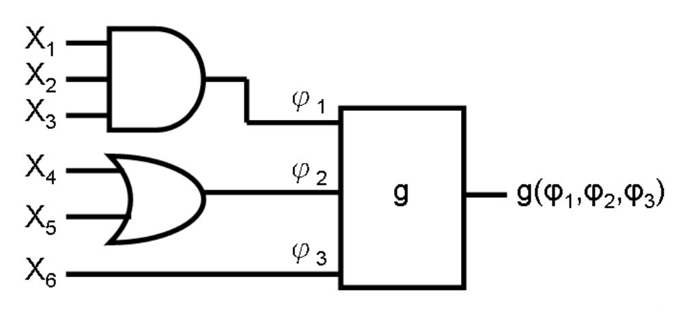
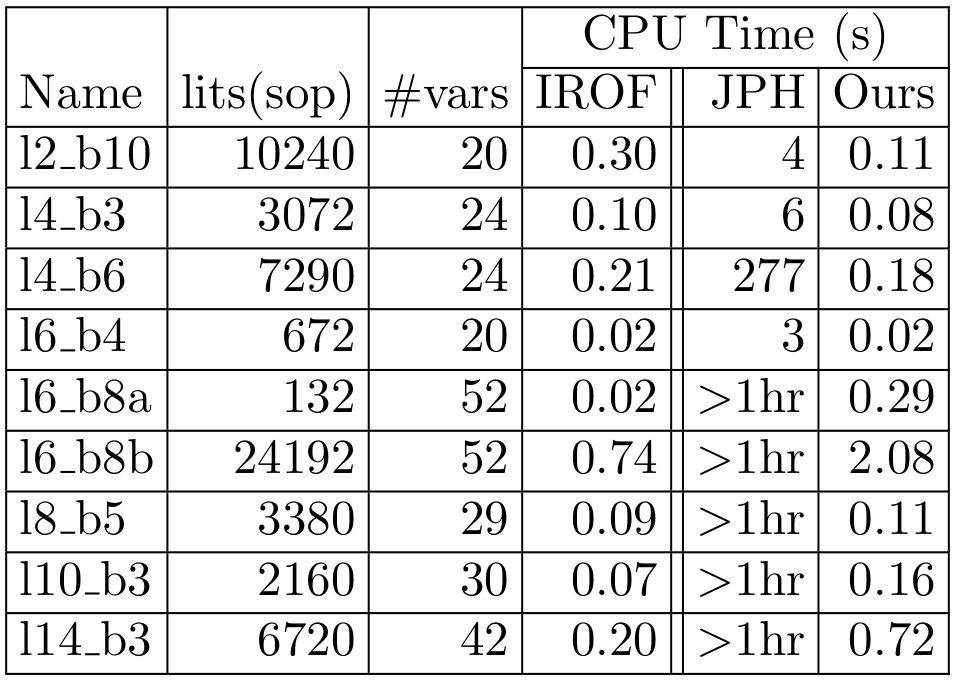

# 簡介

這篇論文[@4196069]討論了有效率地判別布林函數是否為Fanout-less（無扇出）的方法。
作者基於原有的演算法，利用Disappearance（消失）性質與Adjacency（相鄰）性質之間的關係，
設計出了更高效率的演算法，並以實驗證明該演算法的優勢。

# 常用符號與問題定義

Fanout-less
:   布林函式$f(X)$為fanout-less的，
    若且唯若存在一$f$的表示方法，使得$X=\{x_1, \dots, x_n\}$中每個元素在$f$中出現恰一次。

    值得一提的是，在[@10.1145/321906.321918]中，
    fanout-free有一個等價的遞迴定義：

    1. Constant與$x$及$\overline{x}$為fanout-free。
    2. 兩個fanout-free functions $f_1(X_1)$與$f_2(X_2)$，
       其中$X_1\cap X_2 = \emptyset$，經過AND/OR/NOT運算後仍為fanout-free。

Cofactor
:   布林函式$f(X)$對於$x_i=c$（此處$c=0$或$c=1$）的cofactor，
    代表將$f$中$x_i$代入值$c$所得之新的布林函式。
    本文中記作$f(x_i=c)$。

Adjacency
:   布林函式$f(X)$中兩個變數$x_i,x_j\in X$為adjacent，
    若且唯若$f(x_i=c) = f(x_j=c)$。
    本文中記作$x_i =_a x_j$。

    此關係在其他文獻中被證明為集合$X$上的一等價關係，
    因此$=_a$將集合$X$劃分為一或多個類，稱為adjacency classes。

Disappearance
:   變數$x$消失於（disappears in）布林函式$f(X)$，若且唯若$f$之值不受$x$影響。

# JPH演算法

JPH演算法為John P. Hayes在[@10.1145/321906.321918]中提出的fanout-free判別演算法。
該算法主要利用了adjacency關係與以下定理（該論文中定理4）。

\begin{thm}

以adjacency關係將$f(X)$的輸入變數集合$X$劃分為等價類$X_1, X_2, \dots, X_m$，
則存在$\phi_1(X_1), \phi_2(X_2), \dots, \phi_m(X_m)$以及函式$F$，其中$\phi_i$為AND或OR函式，
使得$f(X) = F(\phi_1(X_1), \phi_2(X_2), \dots, \phi_m(X_m))$。

\end{thm}

JPH演算法執行過程為一個迴圈，
每次迭代都利用上述定理，
如[@fig:decomp]所示，
將當前的輸入函式$f_i$之輸入$X_i$劃分為adjacency classes後，
從$f$分離出$\phi_{i_1}, \dots, \phi_{i_r}$等邏輯閘，
再以檢視真值表的方式來建構出剩餘部分的新函式$f_{i+1}$。

{#fig:decomp}

[@fig:jph]展示了JPH演算法的流程。
注意此演算法在每次迭代中，都需要實行兩兩cofactor之間的等效性檢查，
以確認$f_i$的輸入變數之間的adjacency關係。
本篇論文提出了不需等效性檢查的替代做法。

{#fig:jph}

# 新提出的方法

本篇論文提出的演算法大部分基於JPH演算法。
作者推導出了下列disappearance與adjacency之間的等同關係，
並根據這個關係，將判斷adjacency的問題化簡為判斷disappearance的問題。

## 定理推導

\begin{lem}[Adjacency implies disappearance]

令$x_i \neq x_j$為$f(X)$之輸入變數。
若$x_i =_a x_j$，
則$x_j$消失於$f(x_i=a)$中，且$x_i$消失於$f(x_j=a)$中。

\end{lem}

上述引理十分直觀，並且可透過反證法證明。它的逆敘述也成立：

\begin{lem}[Disappearance implies adjacency]

令$x_i \neq x_j$為$f(X)$之輸入變數。
若$x_j$消失於$f(x_i=a)$中，且$x_i$消失於$f(x_j=a)$中，
則$x_i =_a x_j$

\end{lem}

上述引理較不直觀，
需要透過假設$f = x_ix_jA + x_iB + x_jC + (x_i+x_j)D + E$的形式，
並利用前提中的「消失」來推導出$A,B,C,D,E$中哪些項為$0$，
以此驗證兩個cofactor的確相等。

由上述兩個引理，作者得出adjacency與disappearance等價的結論：

\begin{thm}[Adjacency $\Leftrightarrow$ disappearance]

令$x_i \neq x_j$為$f(X)$之輸入變數。
$x_i =_a x_j$，若且唯若
$x_j$消失於$f(x_i=a)$中，且$x_i$消失於$f(x_j=a)$中。

\end{thm}

## 演算法操作範例

以下為作者實際示範使用disappearance性質來檢測adjacency關係的例子。
令輸入為下列$f$：

$$f = x_1x_2x_3x_4 + x_1x_2x_3x_5 + x_4x_6 + x_5x_6$$

1. 與JPH演算法相同，作者先計算了$f$中$x_1, x_2, \dots, x_6$的cofactors。

   $$\begin{cases}
   f(x_1 = 0) = x_4x_6+x_5x_6\\
   f(x_2 = 0) = x_4x_6+x_5x_6\\
   f(x_3 = 0) = x_4x_6+x_5x_6\\
   f(x_4 = 0) = x_1x_2x_3x_5+x_5x_6\\
   f(x_5 = 0) = x_1x_2x_3x_4+x_4x_6\\
   f(x_6 = 0) = x_1x_2x_3x_4+x_1x_2x_3x_5
   \end{cases}$$

2. 接著，作者以列出二維矩陣的方式，來記錄$x_i$中是否有出現$x_j$。
   下列矩陣當中，$(i, j)$項為$0$代表$x_j$消失於$f(x_1 = 0)$的cofactor中；反之則代表有出現。
   由於cofactor的定義，對角線項全為$0$。

   $$\begin{matrix}
   & x_1 & x_2 & x_3 & x_4 & x_5 & x_6\\
   f(x_1 = 0) & \textcolor{gray}{0} & \textcolor{red}{0} & 0 & 1 & 1 & 1\\
   f(x_2 = 0) & \textcolor{red}{0} & \textcolor{gray}{0} & 0 & 1 & 1 & 1\\
   f(x_3 = 0) & 0 & 0 & \textcolor{gray}{0} & 1 & 1 & 1\\
   f(x_4 = 0) & 1 & 1 & 1 & \textcolor{gray}{0} & 1 & 1\\
   f(x_5 = 0) & 1 & 1 & 1 & 1 & \textcolor{gray}{0} & 1\\
   f(x_6 = 0) & 1 & 1 & 1 & 1 & 1 & \textcolor{gray}{0}
   \end{matrix}$$

   若是$(i, j)$項與$(j, i)$為$0$，則由定理可以推出$x_i =_0 x_j$。
   遍歷檢查矩陣中的每一項[^1]，則可以得到所有$=_1$的adjacency關係。
   對$f(x_i = 1)$的cofactors重複步驟1與步驟2，則可以得到$f$中所有的adjacency classes。

   [^1]: 實際上，若$x_i$已被劃入某等價類中，則$f(x_i=a)$列就不需再檢查一次。
   
   此範例中，變數被分為三個等價類：

   $$\textcolor{red}{\{x_1, x_2, x_3\}} \textcolor{blue}{\{x_4, x_5\}} \{x_6\}$$

3. 作者按照JPH演算法的函式拆解定理給出新的函式$g(\phi_1, \phi_2, \phi_3)$應當滿足的條件：

   

   在JPH中，我們需要建造真值表以尋找符合條件的$g$，
   但建造真值表的時間複雜度為$O(2^N)$，其中$N$為變數的數量。
   這邊作者利用division與absorption laws，
   提出了一個基於替換$f$的做法。
   欲尋找$g$的布林表達式，我們只需要在$f$中將$x_i$替換成它的等價類$\phi_k$即可：

   $$\begin{aligned}
   &{} f(x_1, x_2, x_3, x_4, x_5, x_6) = \textcolor{red}{x_1x_2x_3}\textcolor{blue}{x_4}+\textcolor{red}{x_1x_2x_3}\textcolor{blue}{x_5}+\textcolor{blue}{x_4}x_6+\textcolor{blue}{x_5}x_6\\
   & = f(\phi_1, \phi_1, \phi_1, \phi_2, \phi_2, \phi_3) = \textcolor{red}{\phi_1\phi_1\phi_1}\textcolor{blue}{\phi_2}+\textcolor{red}{\phi_1\phi_1\phi_1}\textcolor{blue}{\phi_2}+\textcolor{blue}{\phi_2}\phi_3+\textcolor{blue}{\phi_2}\phi_3\\
   & = g(\phi_1, \phi_2, \phi_3) = \textcolor{red}{\phi_1}\textcolor{blue}{\phi_2} + \textcolor{blue}{\phi_2}\phi_3
   \end{aligned}$$

重複迭代上述三個步驟直到滿足[@fig:jph]中的「$f_i(X_i)$ is fanout-free」
則化簡出的函式為$f$的一個fanout-free表示法。
若途中遇到無任何adjacency關係的狀況，
則$f$並不是一個fanout-free的布林函式。

## 複雜度分析

- JPH演算法：
  對於每一對變數，等效性檢查的時間複雜度為$O(2^N)$，其中$N$為變數個數。
  因此，整體時間複雜度為$O(N^22^N)$。
  此為一exponential time演算法。

- 本文提出算法：
  建造矩陣過程需要處理$N$個cofactors，
  且每個cofactor中約有$NK$個項，其中$K$為product terms的個數。
  因此，時間複雜度為$O(N^2K)$。
  此為一polynomial time演算法。

## 實驗結果

[@fig:exp]為文中給出的實驗結果。
該表顯示了與JPH演算法相比，
本文提出的演算法大幅地減少了執行時間。
表中IROF行為另一演算法；雖然執行時間多較本文提出的算法還短，
但IROF演算法只能做到判斷$f$是否為fanout-free，而不能給出實際的fanout-free表示法，
因此本文提出的方法相當具有競爭力。

{#fig:exp}

# 個人看法

這篇論文提出的方法雖然「簡單」，
但背後的洞察（亦即adjacency與disappearance的關係）並不顯然。
我十分好奇當時作者如何發現這個潛在的關係。
另外，不像[@10.1145/321906.321918]般使用了大量符號化、公式化的敘述，
這篇論文藉由實際操作一個簡單易懂的例子來描述演算法更動的地方，
非常易於閱讀。

我在閱讀後以一支Python程式簡單驗證了作者的想法，
發現了一些文中沒有涵蓋到的實作細節的面向，
例如如何在程式中表示SOP形式的布林函式、
如何在求出cofactor後進行必要的化簡……等，
但大致上演算法流程都十分簡單明瞭。

<!-- vim: set ft=markdown.pandoc colorcolumn=100: -->
