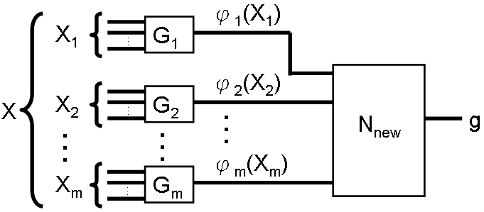
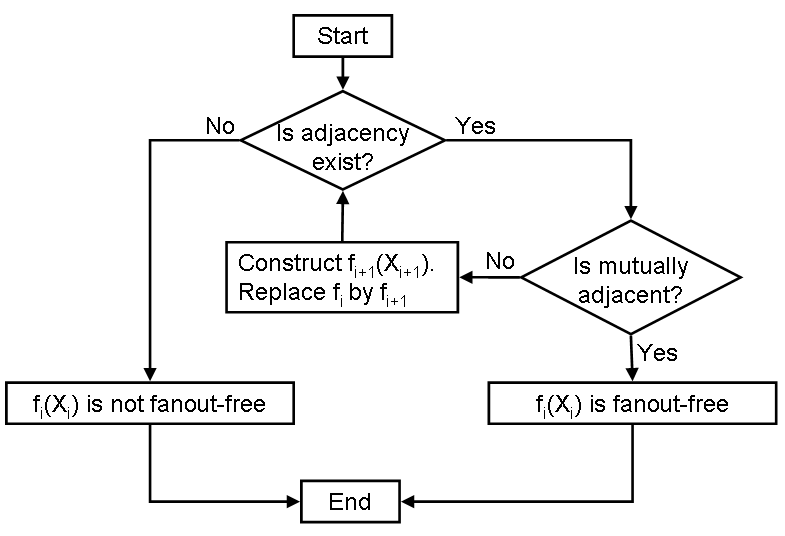

# 簡介

這篇論文討論了有效率地判別布林函數是否為Fanout-less（無扇出）的方法。
作者基於原有的演算法，利用Disappearance（消失）性質與Adjacency（相鄰）性質之間的關係，
設計出了更高效率的演算法，並以實驗證明該演算法的優勢。

# 常用符號與問題定義

Fanout-less
:   布林函式$f(X)$為fanout-less的，
    若且唯若存在一$f$的表示方法，使得$X=\{x_1, \dots, x_n\}$中每個元素在$f$中出現恰一次。

    值得一提的是，在[@10.1145/321906.321918]中，
    fanout-free有一個等價的遞迴定義：

    1. Constant與$x$及$\overline{x}$為fanout-free。
    2. 兩個fanout-free functions $f_1(X_1)$與$f_2(X_2)$，
       其中$X_1\cap X_2 = \emptyset$，經過AND/OR/NOT運算後仍為fanout-free。

Cofactor
:   布林函式$f(X)$對於$x_i=c$（此處$c=0$或$c=1$）的cofactor，
    代表將$f$中$x_i$代入值$c$所得之新的布林函式。
    本文中記作$f(x_i=c)$。

Adjacency
:   布林函式$f(X)$中兩個變數$x_i,x_j\in X$為adjacent，
    若且唯若$f(x_i=c) = f(x_j=c)$。
    本文中記作$x_i =_a x_j$。

    此關係在其他文獻中被證明為集合$X$上的一等價關係，
    因此$=_a$將集合$X$劃分為一或多個類，稱為adjacency classes。

Disappearance
:   變數$x$消失於（disappears in）布林函式$f(X)$，若且唯若$f$之值不受$x$影響。

# JPH演算法

JPH演算法為John P. Hayes在[@10.1145/321906.321918]中提出的fanout-free判別演算法。
該算法主要利用了adjacency關係與以下定理（該論文中定理4）。

\begin{thm}

以adjacency關係將$f(X)$的輸入變數集合$X$劃分為等價類$X_1, X_2, \dots, X_m$，
則存在$\phi_1(X_1), \phi_2(X_2), \dots, \phi_m(X_m)$以及函式$F$，其中$\phi_i$為AND或OR函式，
使得$f(X) = F(\phi_1(X_1), \phi_2(X_2), \dots, \phi_m(X_m))$。

\end{thm}

JPH演算法執行過程為一個迴圈，
每次迭代都利用上述定理，
如[@fig:decomp]所示，
將當前的輸入函式$f_i$之輸入$X_i$劃分為adjacency classes後，
從$f$分離出$\phi_{i_1}, \dots, \phi_{i_r}$等邏輯閘，
再以檢視真值表的方式來建構出剩餘部分的新函式$f_{i+1}$。

{#fig:decomp}

[@fig:jph]展示了JPH演算法的流程。
注意此演算法在每次迭代中，都需要實行兩兩cofactor之間的等效性檢查，
以確認$f_i$的輸入變數之間的adjacency關係。
本篇論文提出了不需等效性檢查的替代做法。

{#fig:jph}

# 新提出的方法

本篇論文提出的演算法大部分基於JPH演算法。
作者推導出了下列disappearance與adjacency之間的等同關係，
並根據這個關係，將判斷adjacency的問題化簡為判斷disappearance的問題。

\begin{lem}

令$x_i \neq x_j$為$f(X)$之輸入變數。若$x_i =_a x_j$，則$x_j$消失於$f(x_i=a)$中，且$x_i$消失於$f(x_j=a)$。

\end{lem}

<!-- vim: set ft=markdown.pandoc colorcolumn=100: -->
